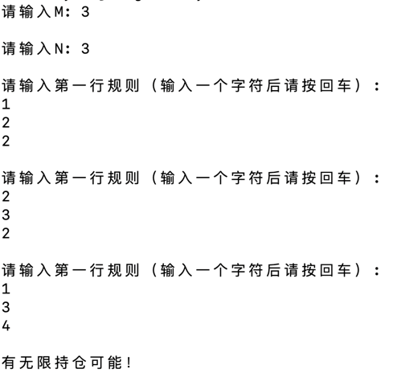

### Usage
下载zip至本地，解压后在文件夹根目录运行以下指令：
```
cd cmake-build-debug
./TradingAlgo
```
在进入指令端程序页面后，按照以下的格式输入测试样例：



### Constraints & Improvements
目前的代码建立在第一行规则的第一个品种为1的基础上，为在此问题上进行优化，可将holdings从vector type改为hashmap。

